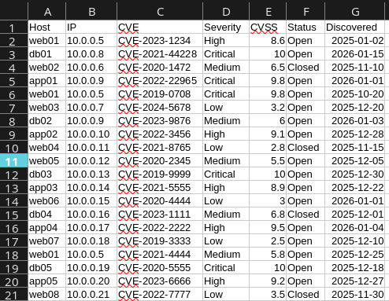
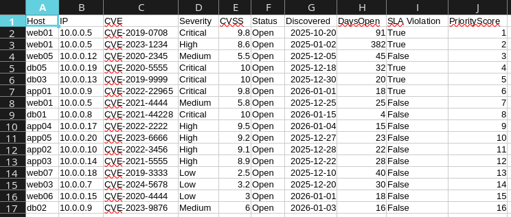

# vuln-prioritization-tool
## Purpose
This tool was built to create an automated, logical process to prioritize vulnerabilities based on their risk.

## Example
### Input

### Output

## Prerequisites
Python 3.10 or newer\
pathlib\
pandas

## Usage
python vuln_prioritizer.py

## Scoring
There are five factors that impact the prioritization of a vulnerability:

1. RiskScore – Severity in numeric form (Critical=4, High=3, Medium=2, Low=1).
2. CVSS – Ranks technical severity.
3. Externally Facing – Currently determined by the hostname, specifically if web is in the hostname. This is a simplified approach; ideally, use a reliable asset inventory or network/subnet information to determine external exposure.
4. SLA Violation – Whether the vulnerability has exceeded the organization’s agreed-upon timeframe for remediation.
5. Vulnerability Age – A multiplier is applied if a vulnerability has been open for 40 days or more.

The final priority score is a weighted combination of these factors, producing a ranked remediation report.

## Potential Future Improvements
This is not a fully featured vulnerability management tool, in fact, there are several enhancements that could make it more accurate or better tailored to an organization:
- IsActivelyExploited – A column that would represent vulnerabilities known to be actively exploited using sources like [RecordedFuture](https://www.recordedfuture.com/)
 or [CISA’s Known Exploited Vulnerabilities Catalog](https://www.cisa.gov/known-exploited-vulnerabilities-catalog)
- Improved External Detection – Ideally, the tool would have more specific criteria in place for determining what is externally facing and what is not. It could pull from sources like the firewall or an asset inventory.
- Dynamic Aging Weights – Adjust AGE_MULTIPLIER by a small increment for each day a vulnerability remains open, maybe something like .001 per day.
- CSV/Excel Input Flexibility – Support for multiple input sources with consistent output formatting. In the case there are multiple csv files with relevant data.
